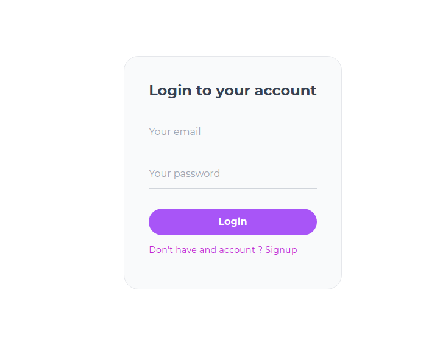
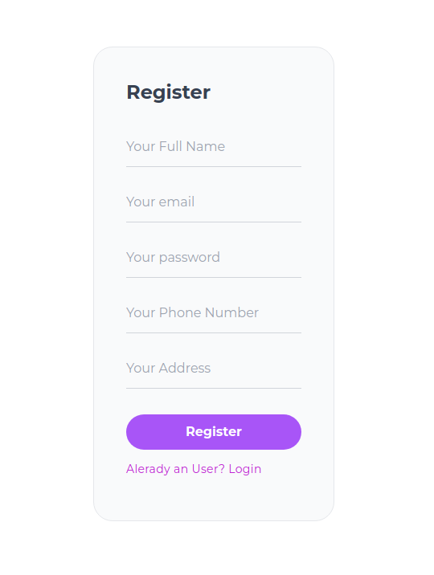
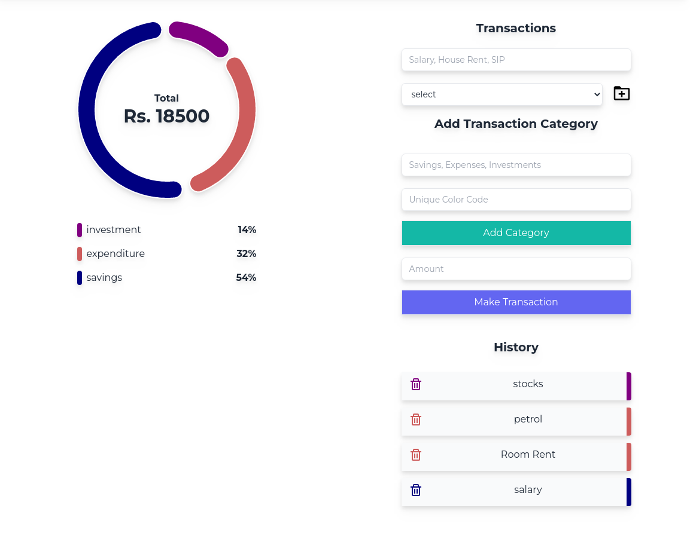
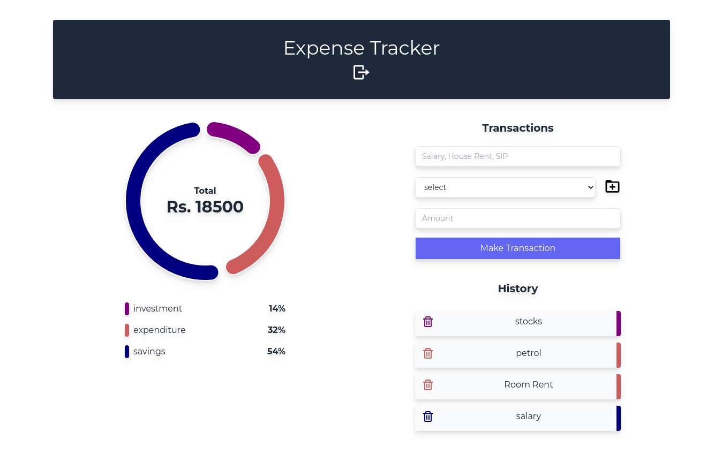

<a name="readme-top"></a>
<!--
*** Thanks for checking out the readme section. If you have a suggestion
*** that would make this better, please fork the repo and create a pull request
*** or simply open an issue with the tag "enhancement".
*** Don't forget to give the project a star!
*** Thanks again! Now go create something AMAZING! :D
-->


<!-- ABOUT THE PROJECT -->
## About The Project
This is an expense tracker app where user can register to the app and login to create the expense transactions.
user can add the expense category and expense transactions.

Features:
* Login/Signup


* logged in user can Create expense category

* logged in user can create transaction
* logged in user can delete transaction


<p align="right">(<a href="#readme-top">back to top</a>)</p>


### Built With

major frameworks/libraries used to bootstrap this project.

* [![Express][Express.js]][https://expressjs.com/]
* [![React][React.js]][https://react.dev/]
* [![Mongodb][Mongodb]][https://www.mongodb.com/]

<p align="right">(<a href="#readme-top">back to top</a>)</p>


<!-- GETTING STARTED -->
## Getting Started

This is an expense tracker app where user can register to the app and login to create the expense transactions.
user can add the expense category and expense transactions.

### Prerequisites

install npm and get started
* npm
  ```sh
  npm install npm@latest -g
  ```

### Installation

_Feel free to clone the repo and make some enhancements._

1. Clone the repo
   ```sh
   git clone https://github.com/asmit-git/mernExpenseTracker.git
   ```
2. Install NPM packages
   ```sh
   npm install
   ```
3. Enter mongodb url and jwt token in `.env`

<p align="right">(<a href="#readme-top">back to top</a>)</p>


<!-- ROADMAP -->
## ToDo

- [x] Add Login with google Feature

<p align="right">(<a href="#readme-top">back to top</a>)</p>


<!-- CONTRIBUTING -->
## Contributing

Contributions are what make the open source community such an amazing place to learn, inspire, and create. Any contributions you make are **greatly appreciated**.

If you have a suggestion that would make this better, please fork the repo and create a pull request. You can also simply open an issue with the tag "enhancement".
Don't forget to give the project a star! Thanks again!

1. Fork the Project
2. Create your Feature Branch (`git checkout -b feature/AmazingFeature`)
3. Commit your Changes (`git commit -m 'Add some AmazingFeature'`)
4. Push to the Branch (`git push origin feature/AmazingFeature`)
5. Open a Pull Request

<p align="right">(<a href="#readme-top">back to top</a>)</p>


<!-- LICENSE -->
## License

Distributed under the MIT License. See `LICENSE.txt` for more information.

<p align="right">(<a href="#readme-top">back to top</a>)</p>


<!-- CONTACT -->
## Contact

Asmit Gautam - [@asmittech](https://www.linkedin.com/in/asmittech/) - mailtoasmitgautam@gmail.com

Project Link: [https://github.com/asmit-git/mernExpenseTracker](https://github.com/asmit-git/mernExpenseTracker)

<p align="right">(<a href="#readme-top">back to top</a>)</p>


